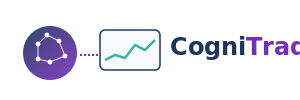

# CogniTrade

  

## 关于我们

CogniTrade是一个专注于将大模型AI技术与量化交易相结合的开源平台。我们的使命是开发先进的数据分析工具和自动化交易系统，帮助交易者在股票、期货和加密货币市场中获利。

## 核心功能

- **数据采集**: 高效获取多市场、多品种的历史和实时交易数据
- **策略开发**: 结合大模型AI技术，辅助创建和优化交易策略
- **回测系统**: 精确模拟历史市场环境，评估策略表现
- **自动化交易**: 连接各大交易所API，实现策略自动执行
- **AI增强分析**: 利用生成式AI提供市场洞察和决策支持

## 项目结构

CogniTrade包含以下核心子项目:

- **DataHub**: 数据采集、清洗和存储系统
- **StrategyLab**: 策略开发和回测环境
- **TradeExecutor**: 自动化交易执行引擎
- **AIAdvisor**: 基于大模型的策略生成和优化工具

## 技术栈

- 数据处理: Rust, Apache Arrow, DataFusion
- 策略开发: Rust
- AI模型: Rust
- 回测引擎: Rust
- 前端界面: Perspective.js

## 开始使用

详细的安装和使用指南请参考各子项目的文档。

## 贡献指南

我们欢迎社区贡献! 请查看[贡献指南](CONTRIBUTING.md)了解如何参与项目开发。

## 许可证

本项目采用 [MIT 许可证](LICENSE)

## 联系我们

- GitHub Issues: 提交问题和功能请求
- 社区论坛: [forum.cognitrade.ai](https://forum.cognitrade.ai)
- 邮箱: contact@cognitrade.ai
